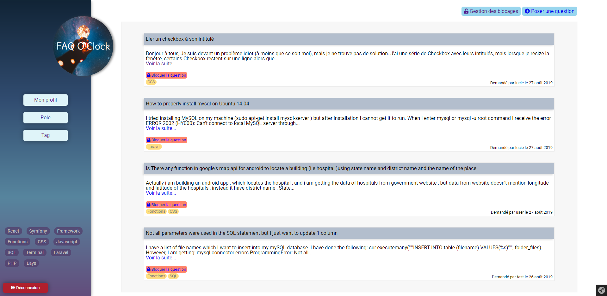
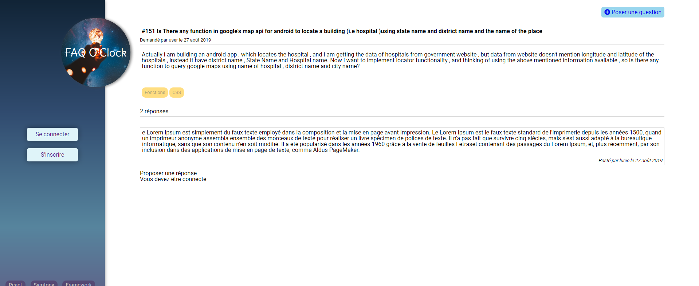
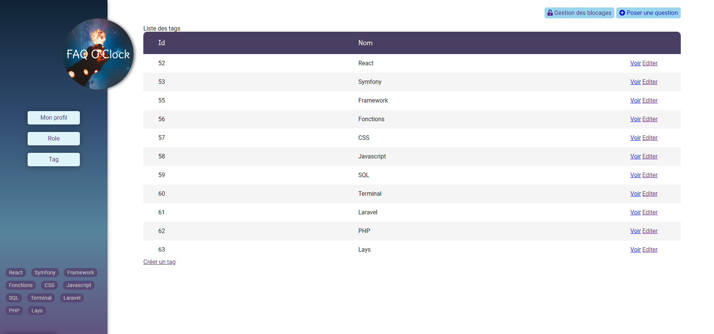
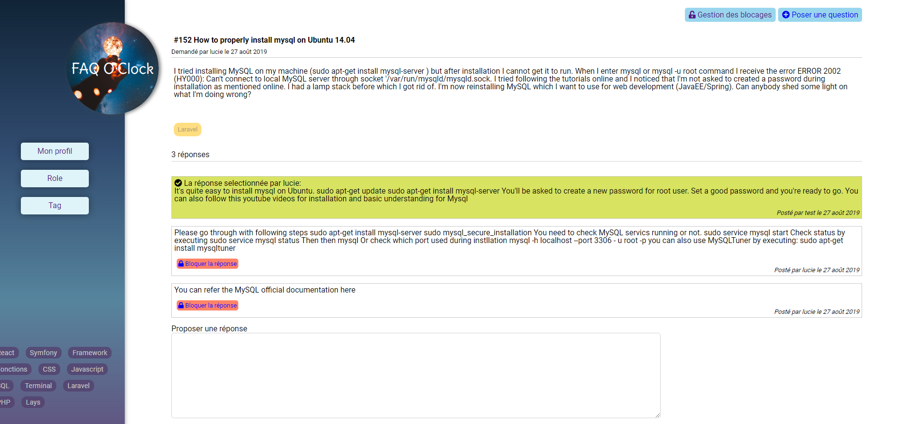

# Parcours - FAQ O'Clock 

> Cet exercice qui est mon premier projet "complet" en Symfony a été réalisé lors de ma formation à O'Clock. Le Parcours étant une évalution qui dure normalement une matinée en général, celui-ci était un peu particulier puisque nous avions une semaine pour le réaliser en dehors des heures de cours de la formation.

Le but de l'application est de faire un site "FAQ" (Foire aux questions) en Symfony où chacun pourrait poser une question ou y répondre sous condition d'être connecté.
L'application contient un espace pour pouvoir modifier/creer les tags et gérer les rôles. L'administrateur peut également bloquer une question ou un commentaire, qui ne sera plus visible pas les utilisateurs.

## Plan du site : 

>Ne pas faire de fixtures, tout est fourni avec le fichier sql qui se trouve dans le dossier docs !
Importer le fichier sql puis lancer `bin/console server:run`

- La page principale avec le menu de navigation où l'on peut se connecter et voir toutes les questions non bloquées (et en poser une). Une fois connecté, le menu change en fonction du rôle (ici admin)

- Une page question comprends toutes réponses apportées à celle-ci et la possibilité d'y répondre si l'on est connecté. Ici la personne ne pourra pas commenter puisqu'elle n'est pas connecté

- Une page "Question by tag" qui regroupe les questions concernées par un tag.
- Une page d'inscription et de connexion

- Les admins et les modos ont également accès à la page de gestion des blocages de questions ou réponses, des roles (seulement l'admin), et des tags (pour les créer, supprimer etc)

Se connecter en tant qu'admin: admin et mot de passe admintest
Se connecter en tant que modo: modo et mot de passe modotest
Pour se connecter en tant que user, vous pouvez créer un compte ;) Ou utiliser user et mot de passe usertest.

Sur la page de profil, on peut retrouver les questions posées ainsi que les réponses que l'on a apporté à une question.
On peut modifier son profil (je n'ai pas réussi à bloquer le changement du role pour un user lambda).

Un utilisateur qui a posé une question peut choisir parmis les réponses une réponse "valide". Celle-ci passe donc au dessus des autres et devient verte. S'il en sélectionne une autre, elle remplace la précédente.

